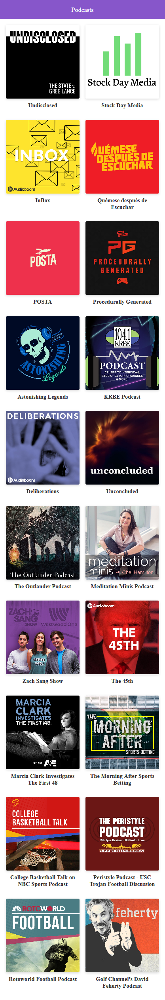

# App para escuchar podcast hecho con next.js

[Ver la aplicación](https://podcast-chi.now.sh/)

## ¿Cómo iniciar el proyecto?

* `npm install` para instalar las dependencias
* `npm run dev` para entorno de desarrollo
* `npm run build && npm run start` para el entorno de producción